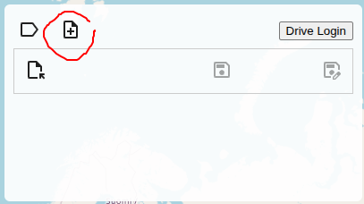
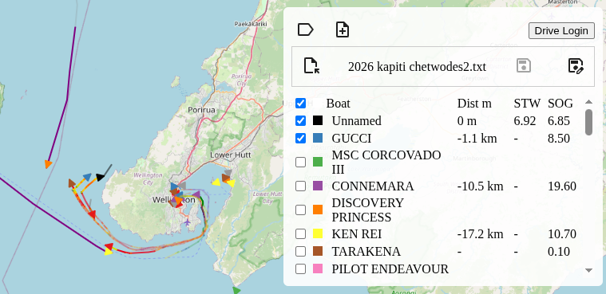
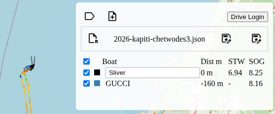
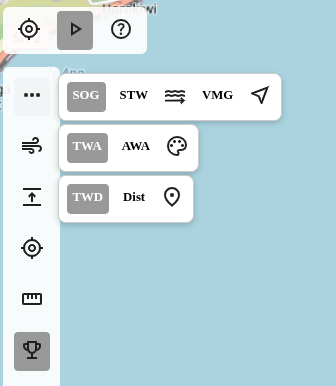

# Sail Data Player Help

This app is for reviewing your sailing data and performance. Major functionality.
- Import NMEA 0183: true wind, apparent wind, speed, sog 
- View other vessels via AIS broadcasts
- Race and performance analytics
- Share races with others
- Polar performance
- Race annotation and notes
- Create a library of polars for sails and conditions
- Merge polars 

## Table of Contents

- [Sail Data Player Help](#sail-data-player-help)
  - [Table of Contents](#table-of-contents)
  - [Importing Data](#importing-data)
    - [Uploading / Importing NMEA 0183 Data](#uploading--importing-nmea-0183-data)
    - [Filtering and Saving as JSON](#filtering-and-saving-as-json)
    - [Viewing a Track](#viewing-a-track)
  - [Player Functions](#player-functions)
    - [Track Color Controls](#track-color-controls)
    - [Wind Barbs](#wind-barbs)
    - [Separation Mode](#separation-mode)
  - [Polars](#polars)
    - [Accessing Polar Builder](#accessing-polar-builder)
    - [Creating a Polar from Race Data](#creating-a-polar-from-race-data)
    - [Viewing the Polar Diagram](#viewing-the-polar-diagram)
    - [Polar Controls](#polar-controls)
    - [Editing Polar Data](#editing-polar-data)
    - [Saving Polars](#saving-polars)
    - [Polar Library](#polar-library)
    - [Merging Polars](#merging-polars)
    - [Tips for Good Polars](#tips-for-good-polars)

---

## Importing Data

This app needs data storage, data is stored in your Google Drive in a folder called `__SailData__`
To use the app you will need to grant it permission to use Google Drive.

> Your data is your own! This app just works with your data on Google Drive
> You can share races with others if you like though using normal Google Drive sharing.

Supported formats:
- NMEA 0183 sentences (https://gpsd.gitlab.io/gpsd/NMEA.html) 

You can get NMEA0183 data from OpenCPN by using the Voyage Data Recorder. You can also potentially log in from many boat hubs which export NMEA0183 over wifi.

### Uploading / Importing NMEA 0183 Data

To upload data from your navigation system:

- Click the **Import** buttons to load raw data from a file  

- Select your NMEA file
- The player will parse the data and display all tracks on the map
- Raw data from disk is automatically be uploaded to your Google Drive `Track_Data` folder  

### Filtering and Saving as JSON

After importing data, you can filter vessels and save:

- Uncheck vessels in the legend to hide them from the track
- Click **Save As** button
- Enter a filename (e.g., `race-2024-01-15.json`)
- Only checked vessels will be saved to Google Drive

### Viewing a Track

Now we are looking at extracted performance data.

- You can set your vessel name  

---

## Player Functions

### Track Color Controls

Change the track color to visualize different metrics:

1. Click the **Speed Data** button (three dots icon) in the left panel
2. Select from the drawer:
   - **SOG** - Speed Over Ground
   - **STW** - Speed Through Water
   - **VMG** - Velocity Made Good
   - **Current** - Current speed and direction
   - **Wind Speed** - True Wind Speed

The track will update with a color gradient showing the selected metric. A legend appears showing the color scale.

### Wind Barbs

Display wind direction and speed on the track:

1. Click the **Wind Barb** button (wind icon) in the left panel
2. Select wind type from the drawer:
   - **TWA** - True Wind Angle
   - **AWA** - Apparent Wind Angle
   - **Color** - Toggle color-coded wind barbs

Wind barbs appear along the track showing direction and strength.

### Separation Mode

View distance separation between vessels:

1. Click the **Separation Mode** button in the left panel
2. Choose separation type:
   - **TWD** - Separation by True Wind Direction
   - **Dist** - Direct distance between vessels
   - **Waypoint** - Distance to a marked waypoint

Separation values appear in the vessel legend in meters.

---

## Polars

The Polar Builder allows you to create and analyze boat performance polars from your race data.

### Accessing Polar Builder

Click the **Polar** button (polar diagram icon) in the top-left mode selector to switch to Polar Builder mode.

### Creating a Polar from Race Data

1. In the left sidebar, you'll see a list of your saved race files
2. Click on a race file to load it
3. The polar diagram will automatically generate from the race data
4. The diagram shows boat speed vs. true wind angle for different wind speeds

### Viewing the Polar Diagram

The polar plot displays:
- **Radial axis**: Boat speed (knots)
- **Angular axis**: True Wind Angle (degrees)
- **Multiple lines**: Each line represents a different true wind speed
- **Color coding**: Lines are colored by wind speed (blue = light, red = strong)

### Polar Controls

**Show Dots Toggle**: Display individual data points used to generate the polar curves

**Half Polar Toggle**: Show only 0-180° (port or starboard tack) instead of full 360°

**Overlay**: Load and overlay another polar for comparison

### Editing Polar Data

The table in the center panel shows the polar data:
- Rows represent True Wind Angles (TWA)
- Columns represent True Wind Speeds (TWS)
- Click any cell to edit the boat speed value
- Empty cells indicate no data for that combination

### Saving Polars

**Save As**: Create a new polar file in your Google Drive Polars folder

**Save**: Update the currently loaded polar file

**Export**: Share the polar as a text file

### Polar Library

The right panel shows your saved polars:
- Click any polar to load it
- Polars are organized by boat/sail configuration
- Use overlays to compare different polars

### Merging Polars

To combine data from multiple races:
1. Load the first race to create a base polar
2. Save it with a descriptive name
3. Load another race
4. Use overlay to compare
5. Manually edit values to merge the best data points

### Tips for Good Polars

- Use races with steady wind conditions
- Include data from multiple wind speeds
- Sail at consistent angles to get good coverage
- Remove data from maneuvers and tacks
- Use annotations to mark clean sailing sections

